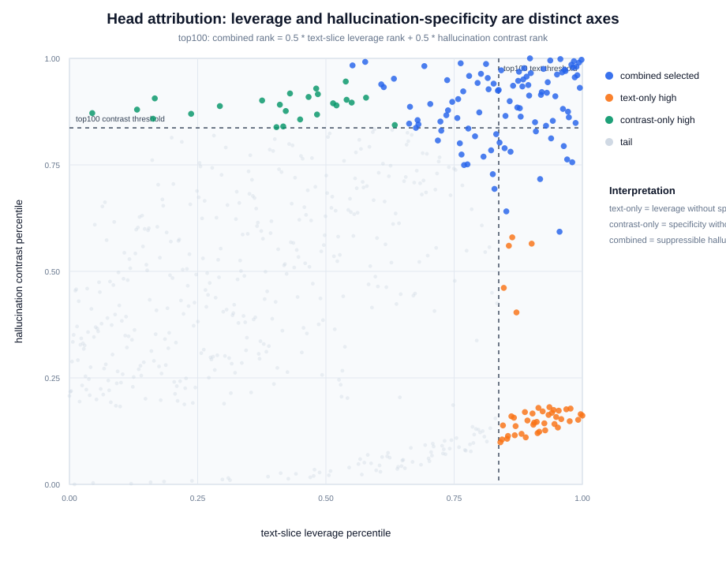
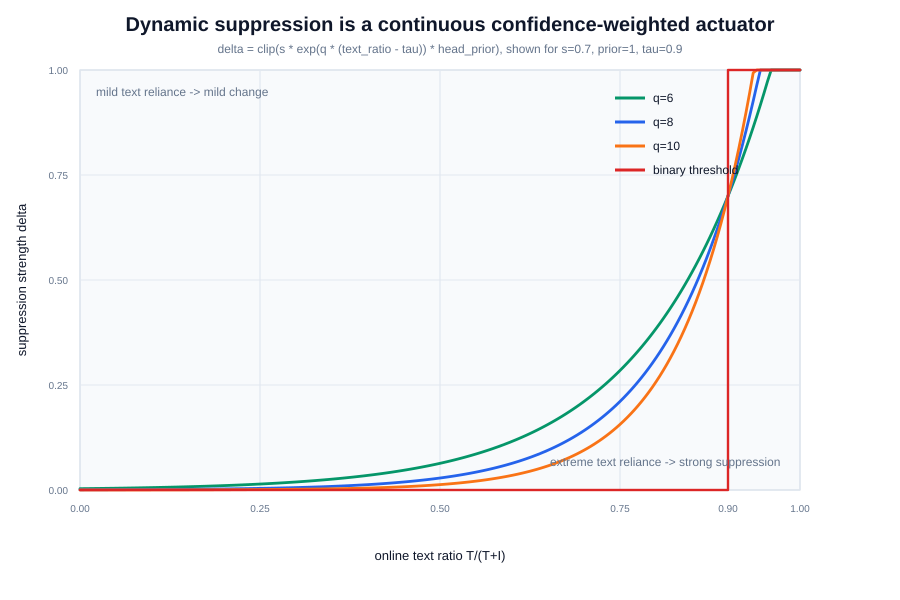
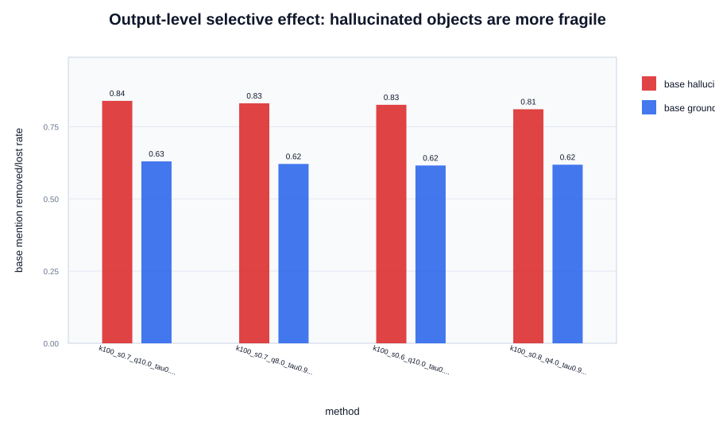

# Method Claim Evidence

This report is organized around our method's own claims, not around AD-HH.

## Q1. Why are these heads hallucination-relevant?

The attribution score combines two different axes:

- `txt_mass / Itext_all`: intervention leverage. It finds heads whose output is actually routed through the text-side attention slice we can suppress.
- `C_toi_HminusG`: hallucination specificity. It finds heads where hallucinated object steps have higher text-over-image reliance than grounded object steps.
- Combined score: leverageable plus hallucination-specific heads.

Numbers from the component split:

- combined top100: n=100, Itext=0.4230, logTOI gap=0.4108, image drop=0.0378.
- text-only high: n=43, Itext=0.4894, logTOI gap=0.0073, image drop=0.0079.
- contrast-only high: n=24, Itext=0.1021, logTOI gap=0.4973, image drop=0.0174.

This is the core attribution justification: text-only heads are leverageable but not necessarily hallucination-specific; contrast-only heads are hallucination-specific but may have weak intervention leverage. The combined pool is the intersection we can act on.

## Q2. Why does dynamic suppression work?

Mechanism: hallucinated objects are supported by text-side context without matching visual evidence. When online text ratio is high, reducing the text-side slice removes that support. Grounded objects have more visual evidence and are less fragile under the same text-side reduction.

This figure gives the continuous-gate rationale. A binary threshold treats all above-threshold states equally; the exponential gate tracks the degree of text dominance.

## Q3. Why continuous and why larger top-k?

Continuous gating is what makes a larger head pool plausible. The offline head pool defines where intervention may happen; the online text ratio defines when and how strongly it happens. Irrelevant or weakly text-dominant head-steps receive low suppression.

## Output-Level Selectivity Check

- strongest available paired run: `llava-v1.5-7b_dynamic_ratio_exp_file_k100_s0.7_q10.0_tau0.90_p1.0_n500_global__itext_all__C_toi_HminusG`
- base hallucinated mention removed rate: 0.8393
- base grounded mention lost rate: 0.6298
- removal/loss ratio: 1.3327

## Missing Evidence To Add With New Runs

1. Per-object-step intervention trace: log online `delta`, `text_ratio`, and `head_score` at generated object steps, then bucket by CHAIR hallucinated vs grounded labels.
2. Ablation matrix: txt-only heads vs contrastive-only heads vs combined heads; binary vs continuous; top20/top50/top100/top150.
3. Caption quality failure taxonomy: show CHAIR reduction is not just length collapse by tracking caption length, grounded object retention, and new hallucination rate.

## Generated Ablation Head Files

- text-only head ranking: `./results/coco/contrastive_dynamic_head_pool_analysis/method_claim_evidence/component_rankings/ranked_heads_itext_all_from_combo.json`
- contrastive-only head ranking: `./results/coco/contrastive_dynamic_head_pool_analysis/method_claim_evidence/component_rankings/ranked_heads_C_toi_HminusG_from_combo.json`
