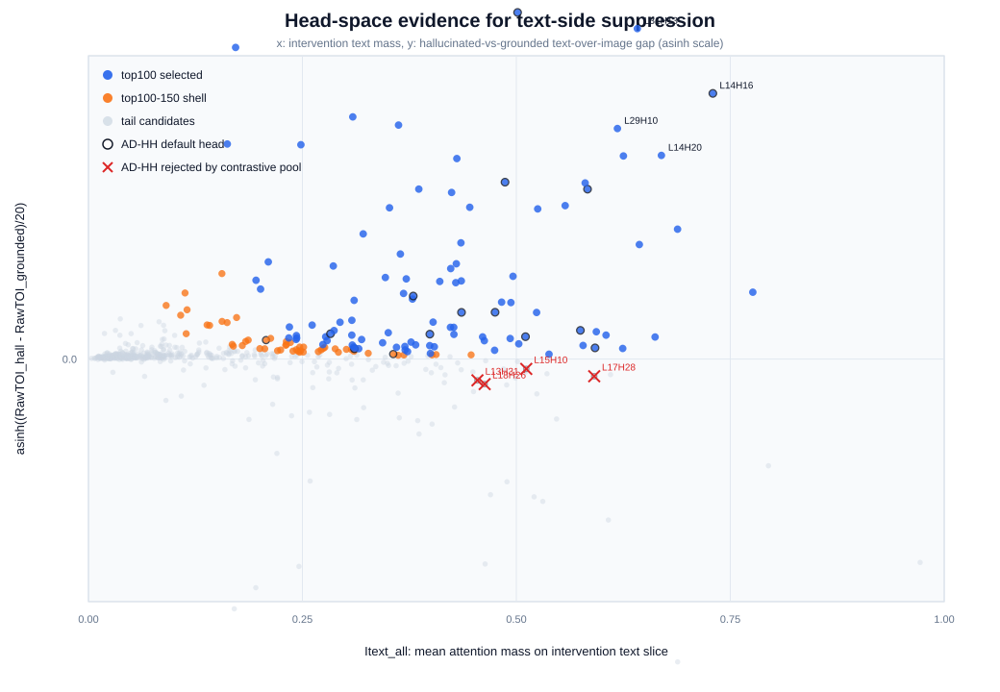
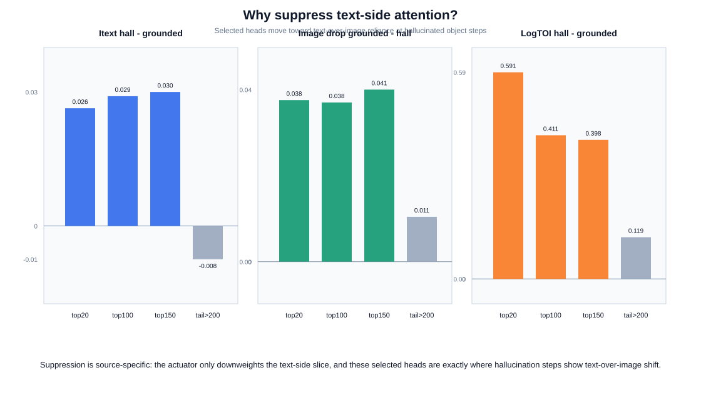
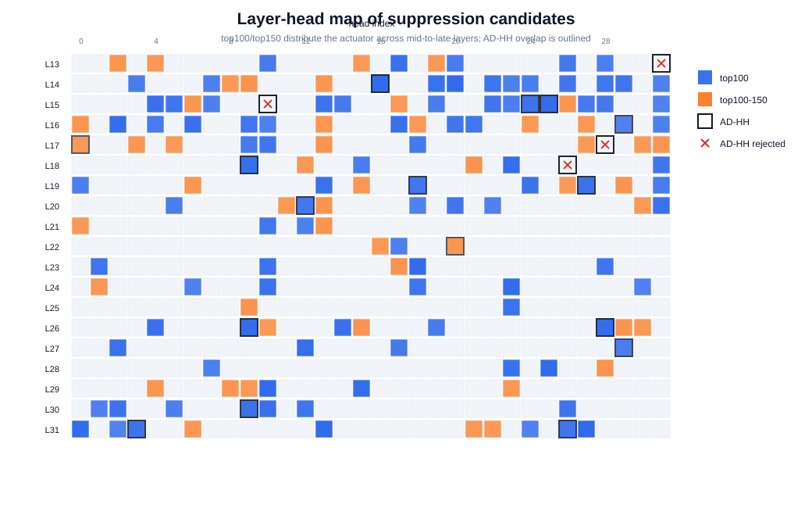

# Suppression Evidence Figures

This bundle supports the intervention rationale independently of final CHAIR scores.
The claim is not just that the selected heads are high-text heads; it is that they are the heads where hallucinated object steps show a source shift toward text-side context and away from image evidence.

## Visual Evidence

## Numbers To Cite

- top100: mean Itext gap H-G=0.0292, image drop G-H=0.0378, logTOI gap H-G=0.4108.
- top150: mean Itext gap H-G=0.0301, image drop G-H=0.0409, logTOI gap H-G=0.3976.
- tail rank>200: mean Itext gap H-G=-0.0075, image drop G-H=0.0106, logTOI gap H-G=0.1194.
- top100 positive RawTOI gap: 100/100; positive image drop: 88/100.
- top150 positive RawTOI gap: 150/150; positive image drop: 133/150.

## Interpretation

1. Text-side suppression is source-matched: the method suppresses exactly the text-side attention slice, and the chosen heads are selected by high intervention-text mass.
2. It is hallucination-specific: selected heads have higher text-over-image ratio on hallucinated object steps than on grounded object steps.
3. It is not a generic language-head mask: AD-HH heads that are high text-mass but weak on hallucination contrast are visually marked as rejected by the contrastive pool.
4. The layer-head map shows that top100/top150 are a distributed mid-to-late actuator scaffold rather than a small fixed AD-HH copy.
